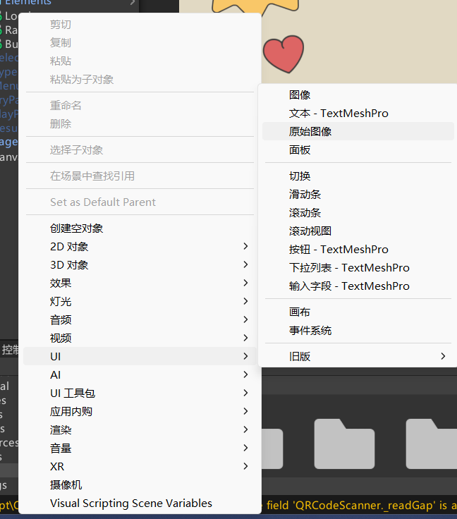
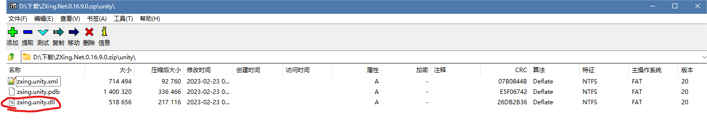
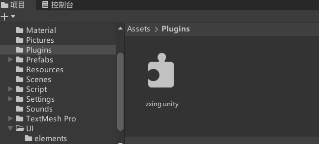
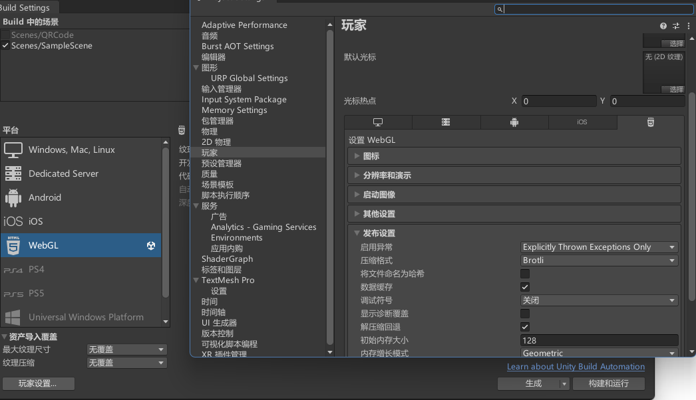
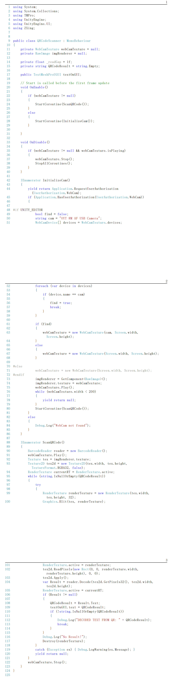
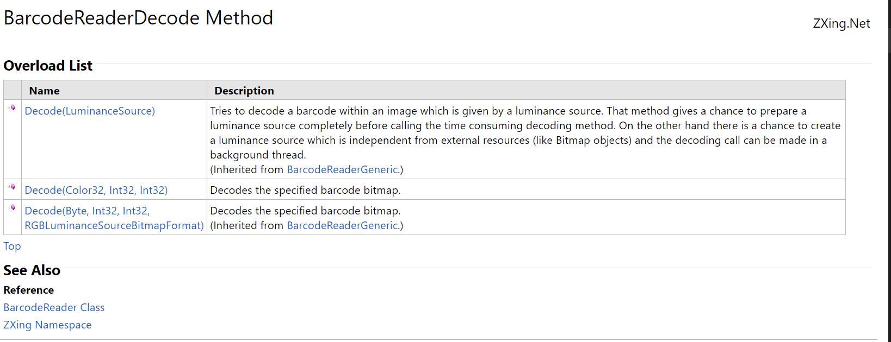

最近作业中遇到了Unity 构建Webgl 之后一直无法成功扫描二维码的相关问题，在这里总结一下答案。

## Unity中的设置

创建一个RawImage（原始图像）

基本上这就是所有需要在Unity Editor中做的事情了，非常的少。

如果还希望让扫描结果显示在界面上的话，则需要再创建一个文本 - TextMeshPro （就在原始图像选项的上面）

接下来就是代码部分了。

##  ZXing库的下载与使用

ZXing是一个GitHub上大佬写的开源项目，是一个跨平台的解码库。我们就用这个库来扫描我们的二维码。

在这里附上下载链接：https://github.com/micjahn/ZXing.Net/releases

我这里使用的是0.16.9版本，下载完ZXing.Net.0.16.9.0.zip之后，里面有个Unity文件夹，我们要的就是里面的dll文件

接下来在Unity的Asset中创建一个Plugin文件夹，把这个dll文件放进去。

ZXing的准备工作完成！

## C#脚本部分

创建一个脚本，名为QRCodeScanner

几个事项写在前面:

- 在此之前记得下载ZXing的二维码扫描库！！！
- 在玩家设置中将启动异常调为Explicitly Thrown Exceptions Only
- Unity 中，对摄像头进行访问后显示到屏幕上的流程相当于是把摄像头获取的画面当作纹理(Texture)然后将该纹理赋值给RawIamge的纹理。这样就能在显示器中显示摄像头捕捉到的内容了
- Unity Editor中和 Unity Webgl中所呈现出来的效果是一样的，但是对于二维码扫描部分则是完全不一样。
- 在这里提出的解决方案比较耗内存，后续有任何优化的话，都会放在这里面。

整个过程将会围绕着WebCamTexture和协程开始，在网上有很多其他的Unity二维码扫描实例，但是没有任何一个是可以在Webgl上适配的。

先附上代码: https://github.com/ClainChen/BlogCodeRepo/blob/main/UnityQRCodeScanWebgl/QRCodeScanner.cs

### 摄像机使用

- 我们将用WebCamTexture来获取摄像头内容，但在此之前，必须要先向设备申请摄像头的使用权限：` Application.RequestUserAuthorization(UserAuthorization.WebCam);`
  - 在权限获取成功之后，才能进行接下来的操作。
- 创建一个`new WebCamTexture(name, width, height)`，如果有自己的外接摄像头的话，则需要对那个摄像头进行访问后，将设备名称放在`name`位置上, 而width和height，需要自己好好斟酌，试错之后再决定。我这里直接写的`Screen.width`和`Screen.height`获取屏幕宽度和高度。
- 接下来是把WebCamTexture的纹理赋值给RawIamge：`imgRenderer.texture = webCamTexture`
- 然后播放`webCamTexture`，回到Unity界面，点击播放，现在应该就可以看到自己的相机被成功使用了。

### 二维码扫描

我们创建了一个名为`ScanQRCode`的枚举器，必须确保是每一帧（或自己决定）都会对图像进行一次扫描。我们不能在这里直接用while，不然Unity程序会直接卡住。

创建一个`BarcodeReader`这是ZXing库中的一个类，顾名思义，用来读取Barcode的内容。

接下来是重要的时刻了，在此之前进行说明

- ZXing中提供了一个非常方便的解码方法，名为`Decode`，但是因为HTML网页的特性，我们不能直接用webCamTexture来进行解码！
- 听老师讲解后我才明白，HTML web网页的运行逻辑是每一帧都会将网页用黑色填充，而webCamTexture是进行帧调用的对象，所以在每帧开始时这个对象将会是纯黑色的！因此如果直接对`webCamTexture`进行编码，你将永远也扫不出来信息。
- 所以我们现在只能将目光转移到`RawImage`的Texture上，这是底层代码且不会变成纯黑（如果是纯黑的话，webgl界面上我们将不可能看得到摄像机效果）。然而，`BarCodeReader.Decode()`中，并不支持纯Texture。

从ZXing提供的解释文档中可以看出，并不支持直接使用Texture进行解码

但是Color32[] 和 Byte[] （图中的Color32和Byte其实是Color32[] 和 Byte[]）可以从Texture2D获取，因此我们只需要将Texture转为Texture2D即可。

但是在Unity中，将Texture转为Texture2D是比较麻烦的，我们并不能单纯的用`Textrue2D tex2d = (Texture2D)tex` 或 `Texture2D tex2d = (tex as Texture2D)`来进行转换，必须要经过一系列处理才行。（代码92-103行）

这样便可以在webgl中进行二维码解码了，不过要注意的是，这个方法很耗内存，需要自己思考如何进行优化。

`reader.Decode()`的结果是一个Result类型，该类型中有个text，这便是我们需要的信息。

以上
